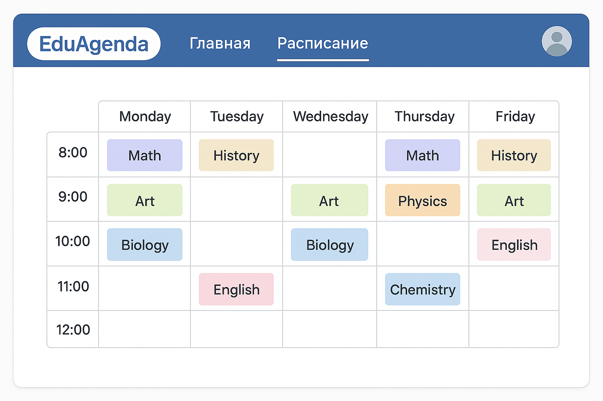

# EduAgenda 
___

**EduAgenda** — это система для планирования учебных занятий и регистрации учащихся.
Она предназначена для автоматизации составления расписания в учебных заведениях и мониторинга посещаемости занятий.
Также система позволяет отслеживать студентам свое учеьное расписание

## Описание MVP

MVP будет включать базовую функциональностьпо созданию учебного занятия и его привязки к группам студентов

#### Основные функции в MVP:
1. **Управление занятиями (CRUD)**
2. **Управление аудиториями (CRUD)**
3. **Управление группами (CRUD)**

[//]: # (4. **Управление преподавателями &#40;CRUD&#41;**)

**Связь между сущностями**
   - Привязка занятий к группам студентов: занятие может быть привязано к нескольким учебным группам.
   - Привязка занятий к аудиториям: занятие может быть привязано к нескольким аудиториям. Важно учитывать вместимость аудитории и количество учащихся в группах.

[//]: # (   - Привязка занятий к преподавателям: занятие может быть привязано к нескольким преподавателям. Преподаватель может вести несколько занятий.)

## Документация

1. [Целевая аудитория и портреты клиентов](./doc/biz/target-group.md)
2. [Стейкхолдеры](./doc/biz/stakeholders.md)
3. [User stories](./doc/biz/user-story.md)
4. [Сущности](./doc/api/entities.md) 

